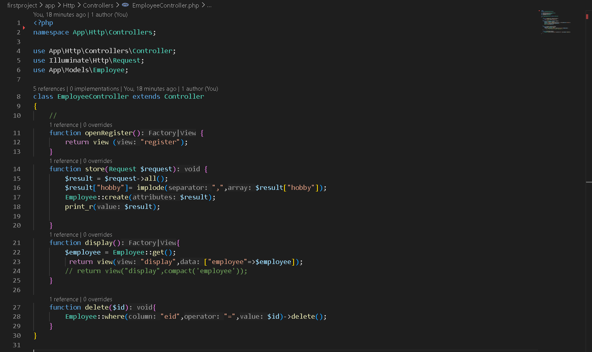
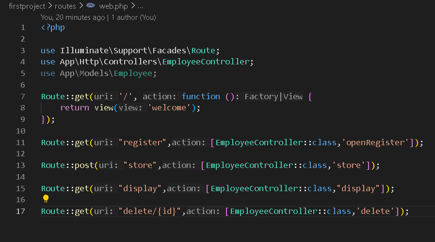

First to initialize the project , 

->
    composer create-project laravel\laravel crud(filename)

app->http->controllers =  all controllers will be here 

app->models = all models will be here 

database -> migrations = whicherver table we will create will be here 

resources -> views = all blade file which means all the files which contains User Interface will be here 

routes -> web.php = all the routes will be defined here

.env = contain all the important info like datbase name, password, port, username etc

DB_CONNECTION = mysql (change here)
DB_HOST = 127.0.0.1
DB_PORT = 3306
DB_DATABASE = EmployeeManagment (change here)
DB_USERNAME = root
DB_PASSWORD=

SESSION_DRIVER = file (change here)

**********************************************

To Run The Project -> php artisan serv

**********************************************

To Create the table ->

php artisan make:migration create_employee_table

database->migration : here the file will be created as create_employee_table.php

in this file we will write the code to create the table

    $table->string("name");
    $table->string("email")->unique();
    $table->enum("gender",["male","female"])
    $table->string("email")

after mentioning columns in file we will write in terminal 

    php artisan migrate

to make the views we need to write in terminal

    php artisan make:view register(filename)
    php artisan make:view display(filename)
    php artisan make:view delete(filename)
    php artisan make:view update(filename)

to make the controller we need to write in terminal

    php artisan make:controller EmployeeController

to make model 

    php artisan make:model Employee

after creating all the files in register view file we will write a code for UI and make a form for that 

and to pass the data from one page to another page we have to write @csrf

in app->models->Employee.php

we have to write two things

1) protected $table= "employee";
2) protected fillable = [all the fileds name we have to pass from front end to backend];

in app->http->controllers->EmployeeController.php

we have to make functions like 

in routes folder there are file called web.php which very important which includes all the routes and path :

